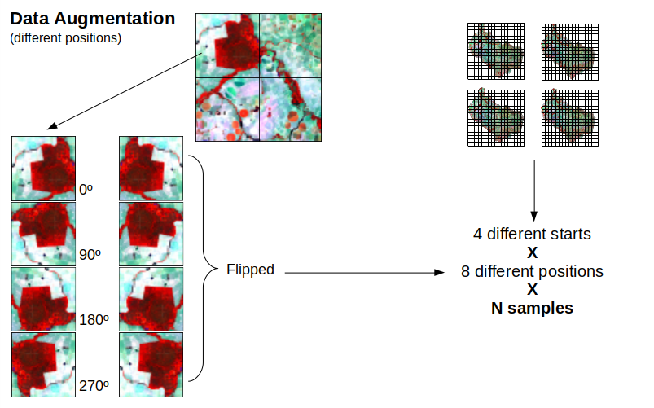
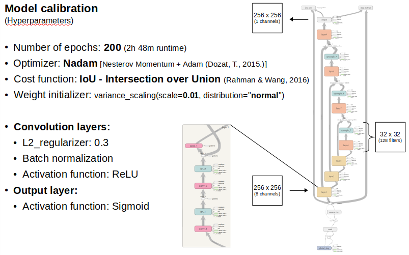

# Deep Learning for Landsat 

## Dependencies
* *python 3*
* *numpy*
* *scipy*
* *sklearn*
* *gdal*
* *tensorflow>=1.4*
* *rasterio>=1.0a12*
* *RIOS>=1.4.4 (only for normalization script)*

## Input Data
* Download link: https://www.lapig.iesa.ufg.br/lapig/nextgenmap-data/Landsat/
* Scene ID: LC08_L1TP_223071_20160905_20170321_01_T1
* Spectral data: Blue, Green, Red, NIR, SWIR1, SWIR2, Thermal, NDVI (8 bands)
* Reference data: Pasturelands Map (value 1 for pasture pixels)

## Data Augmentation

## Implemented models

### U-net

Results: [Pasturelands Mapping](docs/presentations/pasturelands_mapping.pdf)

## How works

**Train**
python3 run.py train LC08_L1TP_223071_20160905_20170321_01_T1.img 0

**Evaluate**
python3 run.py evaluate LC08_L1TP_223071_20160905_20170321_01_T1.img 0

**Predict**
python3 run.py predict LC08_L1TP_223071_20160905_20170321_01_T1.img 0